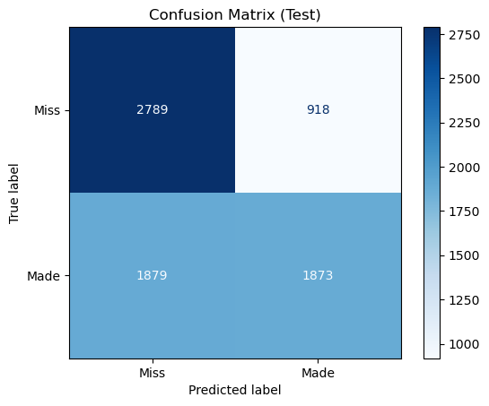
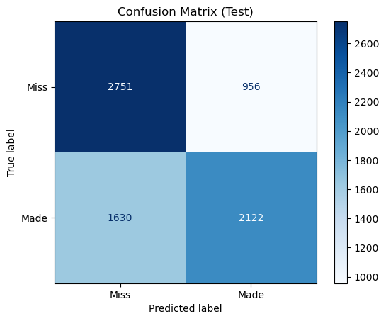
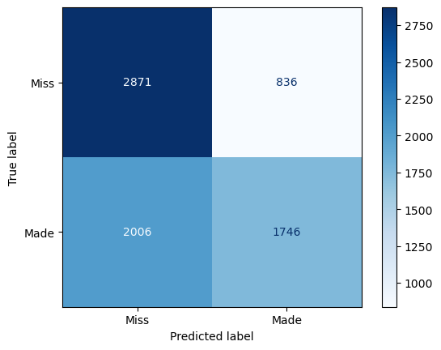
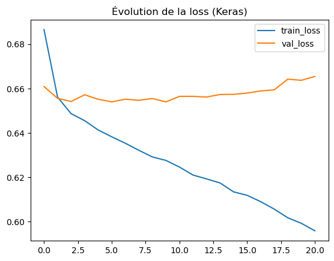

# NBA — Modèles de Machine Learning et Deep Learning

## Introduction
La variable cible Tir réussi/raté nous amène à des modèles de classification. 
En effet, l'entrainement à partir des variables explicatives doit permettre au modèle d'ajuster ses capacités à prédire correctement 
les tirs des meilleurs joueurs nba sélectionnés, en fonction de la situation sur le terrain, que le ballon rentre ou pas.

## Modèles de Machine Learning
Nous allons entraîner et prédire sur nos données avec un grand nombre de modèles de classification, avec deux approches :
- Une première approche plus exploratoire, avec des essais successifs des modèles principalement rencontrés dans nos cours.
- Une seconde approche, basée sur l'automl

Dans la première, nous utiliserons notamment :
- Regression Logistique
- RandomForest
- SVM
- XGBoost

Dans la seconde, nous utiliserons le LazyClassifier et Tpot.

## Modèle de Deep Learning

Nous utiliserons un modèle séquentiel multi-couches denses.

## Organisation et méthodologie des tests avec les modèles ML
Dans la première approche, nous procédons à la succession des tâches classiques attendues pour entrâiner et prédire pour les modèles de type classification :
_ Séparation des jeux d'entraînement et de tests, avec des sauvegardes régulières à chaque étape.
_ Utilisation des pipelines pour automatiser les enchaînements des tâches et en tester de nombreuses variantes.

Les pipelines permettront notamment de construire différents scénarii de tests :
_ Standardisation et normalisation des données en fonction du type de variable et de leur distribution
_ Lancement des différents modèles
_ Recherche et application des meilleurs modeles / parametres avec de la validation croisée (GridSearchCV)

La seconde approche permettra, notamment avec le LazyClassifier, de recouper les résultats de la première approche avec les meilleurs modèles proposés en automl.

## Analyse des résultats
Utilisation des métriques et matrices de correlations pour analyser les prédictions.
Détermination des variables les plus importantes pour le modèle le plus efficace.

## Organisation et méthodologie des tests avec le modèle DL
Nous créons un modèle de deep learning séquentiel et nous jouons ensuite sur les couches et paramètres des couches denses du modèle (relu, sigmoide, etc.)

## Analyse des résultats
Utilisation des métriques et courbe d'apprentissage pour analyser les prédictions.

## Présentation des résultats
A la suite des premiers résultats plutôt bons, nous constatons que l'un des variables utilisées n'est pas correcte, car elle permet en fait au modèle de prédire
de manière bien trop correcte le résultat d'un tir. Après analyse, il s'avère que nous devons supprimer cette variable et recommencer notre cycle avec les modèles.
Les résultats sont du coup beaucoup moins bons et sont présentés ci dessous.

Ce tableau récapitule les résultats des modèles ML et Deep Learning et quelques graphiques suivent pour illustrer.

- Randomforest simple sans gridsearch avec toutes les features

  precision    recall  f1-score   support

        Miss       0.59      0.67      0.62      3707
        Made       0.62      0.54      0.57      3752

    accuracy                           0.60      7459
   macro avg       0.60      0.60      0.60      7459
weighted avg       0.60      0.60      0.60      7459

AUC ROC: 0.6432534066535794

- Randomforest avec GridSearchCV

Fitting 3 folds for each of 27 candidates, totalling 81 fits
Best params: {'classifier__max_depth': 5, 'classifier__min_samples_split': 2, 'classifier__n_estimators': 600}
Best CV score: 0.6176445363698785

Classification Report :
              precision    recall  f1-score   support

        Miss       0.60      0.75      0.67      3707
        Made       0.67      0.50      0.57      3752

    accuracy                           0.63      7459
   macro avg       0.63      0.63      0.62      7459
weighted avg       0.63      0.63      0.62      7459

- XGBoost avec GridSearchCV

Fitting 3 folds for each of 48 candidates, totalling 144 fits
Best params: {'classifier__colsample_bytree': 1, 'classifier__learning_rate': 0.05, 'classifier__max_depth': 6, 'classifier__n_estimators': 100, 'classifier__subsample': 1}
Best CV score: 0.6574653812037567

Classification Report (Test):
              precision    recall  f1-score   support

        Miss       0.63      0.74      0.68      3707
        Made       0.69      0.57      0.62      3752

    accuracy                           0.65      7459
   macro avg       0.66      0.65      0.65      7459
weighted avg       0.66      0.65      0.65      7459

- Comparatif Features Importances

Deep Learning
| AUC                | accuracy           | loss               | val_AUC            | val_accuracy       | val_loss           | learning_rate         |
|--------------------|--------------------|--------------------|--------------------|--------------------|--------------------|-----------------------|
| 0.6652929186820984 | 0.6247828602790833 | 0.6501372456550598 | 0.695338785648346  | 0.6448423266410828 | 0.6304792761802673 | 0.0010000000474974513 |
| 0.6894456148147583 | 0.6403848528862    | 0.6346036791801453 | 0.7027294039726257 | 0.6495189666748047 | 0.6265406012535095 | 0.0010000000474974513 |
| 0.6971496343612671 | 0.6449953317642212 | 0.6294234991073608 | 0.7062937021255493 | 0.6570016145706177 | 0.6272188425064087 | 0.0010000000474974513 |
| 0.7053139209747314 | 0.6498730182647705 | 0.6240957379341125 | 0.7104877233505249 | 0.6552645564079285 | 0.6209590435028076 | 0.0010000000474974513 |
| 0.7120987176895142 | 0.655853271484375  | 0.6186979413032532 | 0.7109962701797485 | 0.6537947654724121 | 0.6206334829330444 | 0.0010000000474974513 |
| 0.7175825834274292 | 0.6567553281784058 | 0.6151641607284546 | 0.7136446237564087 | 0.6568679809570312 | 0.6189153790473938 | 0.0010000000474974513 |
| 0.7228341102600098 | 0.6620005369186401 | 0.6111533641815186 | 0.7099555134773254 | 0.6497862339019775 | 0.620480477809906  | 0.0010000000474974513 |
| 0.7287951707839966 | 0.6642055511474609 | 0.6063814759254456 | 0.7142128944396973 | 0.6616782546043396 | 0.6184107661247253 | 0.0010000000474974513 |
| 0.7345260381698608 | 0.6711211800575256 | 0.6017042398452759 | 0.715204119682312  | 0.6578032970428467 | 0.6194249391555786 | 0.0010000000474974513 |
| 0.7417919039726257 | 0.6768007278442383 | 0.5964009165763855 | 0.7087304592132568 | 0.6493853330612183 | 0.6219863891601562 | 0.0010000000474974513 |
| 0.7459501028060913 | 0.6804089546203613 | 0.5926315784454346 | 0.715950071811676  | 0.6580705642700195 | 0.6169125437736511 | 0.0010000000474974513 |
| 0.7521457076072693 | 0.6824802756309509 | 0.5861309766769409 | 0.7140228748321533 | 0.6594067215919495 | 0.6187199354171753 | 0.0010000000474974513 |
| 0.7577382326126099 | 0.6873914003372192 | 0.5820276141166687 | 0.7149044871330261 | 0.6549973487854004 | 0.6241438984870911 | 0.0010000000474974513 |
| 0.7630536556243896 | 0.6910998225212097 | 0.5763023495674133 | 0.7077662944793701 | 0.6537947654724121 | 0.6252628564834595 | 0.0010000000474974513 |
| 0.7697086334228516 | 0.6978818774223328 | 0.570953369140625  | 0.7114466428756714 | 0.650187075138092  | 0.625138521194458  | 0.0010000000474974513 |
| 0.7736958265304565 | 0.70022052526474   | 0.5671008825302124 | 0.7135577201843262 | 0.6541956067085266 | 0.626248836517334  | 0.0010000000474974513 |
| 0.7962092757225037 | 0.719430685043335  | 0.5450907945632935 | 0.7109345197677612 | 0.6499198079109192 | 0.6305218935012817 | 0.0005000000237487257 |
| 0.7990372776985168 | 0.7187959551811218 | 0.5410075783729553 | 0.7028393149375916 | 0.6463121175765991 | 0.6321934461593628 | 0.0005000000237487257 |
| 0.8047012686729431 | 0.7263463735580444 | 0.5348836779594421 | 0.7058124542236328 | 0.6489844918251038 | 0.6363850235939026 | 0.0005000000237487257 |
| 0.808404266834259  | 0.728484570980072  | 0.5310264825820923 | 0.7019742727279663 | 0.6485836505889893 | 0.6391842365264893 | 0.0005000000237487257 |
| 0.813986599445343  | 0.7317586541175842 | 0.5247366428375244 | 0.698743462562561  | 0.6393640041351318 | 0.6448138952255249 | 0.0005000000237487257 |

- Deep Learning Keras

precision    recall  f1-score   support

        Miss       0.59      0.77      0.67      3707
        Made       0.68      0.47      0.55      3752

    accuracy                           0.62      7459
   macro avg       0.63      0.62      0.61      7459
weighted avg       0.63      0.62      0.61      7459

AUC ROC: 0.655518639317191

## Conclusion 

On note à ce stade qu'il n'y a pas beaucoup d'écarts entre les 5 meilleurs modèles ML, tous tournent entre 0.65 et 0.68 sur l'accuracy, après optimisation.
Le modèle de deep learning n'est pas bien meilleur que les modèles ML, nous sommes dans un cas où nous n'avons sans doute pas assez de volume de données pour pousser 
plus loin ce type de modèle.

Nous avons à la fois sans doute un problème de volume de données, mais surtout de données pertinentes pour l'apprentissasge de nos modèles de classification.

Nous rentrons donc dans un cycle de recherche de nouvelles données pour compléter notre extraction initiale, mais aussi de recherche de variables composées (facteur de fatigue et de santé du joueur par exemple).
